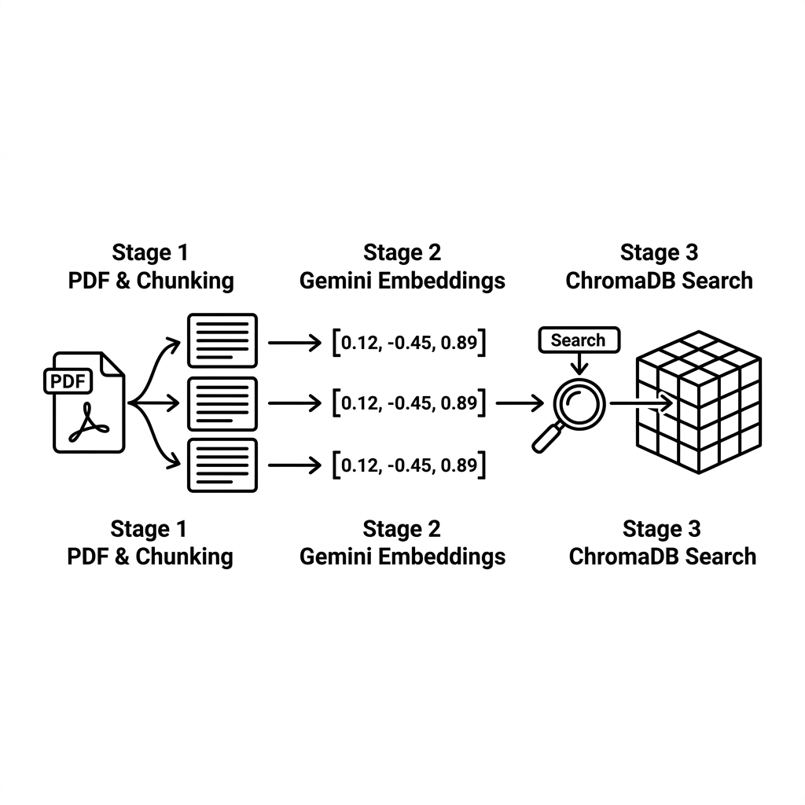

### vector-doc-engine

[](https://www.typescriptlang.org/)
[](https://www.trychroma.com/)
[](https://ai.google.dev/)
[](LICENSE)
[](https://github.com/DileepWick/vector-doc-engine/actions)

Production-resilient TypeScript engine for PDF document text chunking, Google Gemini vector embeddings, and local ChromaDB HNSW semantic vector search.



---

#### Features

- **Recursive Sentence-Aware Chunking**: Hierarchical text splitting (`\n\n` $\rightarrow$ `\n` $\rightarrow$ `. ` $\rightarrow$ ` `) to preserve sentence boundaries.
- **Resilient API Processing**: Exponential backoff with delay jitter retries to handle Gemini API rate limits (`HTTP 429`) and network dropouts.
- **Memory Efficient Ingestion**: $O(1)$ streaming batch flushes to prevent heap memory exhaustion on large documents.
- **Relevance Guardrails**: Bounded similarity scoring with minimum threshold filtering.

---

#### Installation

Install as a dependency in your Node.js or TypeScript project:

```bash
npm install git+https://github.com/DileepWick/vector-doc-engine.git
```

Or via GitHub Packages registry:

```bash
npm install @dileepwick/vector-doc-engine
```

---

#### Quick Start

##### 1. Environment Configuration

Create a `.env` file in your root directory:

```env
CHROMA_URL=http://localhost:8000
GEMINI_API_KEY=your_gemini_api_key
GEMINI_EMBED_MODEL=gemini-embedding-2-preview
```

##### 2. Infrastructure Setup

Start a local ChromaDB instance:

```bash
docker run -p 8000:8000 chromadb/chroma
```

##### 3. Programmatic Usage

**Ingest PDF Document**

```typescript
import { ingestPdfDocument } from "@dileepwick/vector-doc-engine";

const result = await ingestPdfDocument({
  filePath: "./data/documents/sem-reg.pdf",
});

console.log(`Ingested ${result.totalChunks} chunks.`);
```

**Perform Vector Search Query**

```typescript
import { queryVectorSearch } from "@dileepwick/vector-doc-engine";

const matches = await queryVectorSearch({
  query: "What are the main key takeaways?",
  topK: 3,
  minSimilarity: 0.35,
});

matches.forEach((match, idx) => {
  console.log(`[${idx + 1}] Score: ${match.score.toFixed(4)} | Excerpt: "${match.doc}"`);
});
```

---

#### CLI Usage

**Build Package**
```bash
npm run build
```

**Ingest Document via CLI**
```bash
npx ts-node src/ingest.ts sem-reg.pdf
```

**Query Vector Search via CLI**
```bash
npx ts-node src/ask.ts "What are the key takeaways?"
```

---

#### Repository Structure

```text
vector-doc-engine/
├── src/
│   ├── index.ts               # Public API exports
│   ├── ingest.ts              # Document ingestion API
│   ├── ask.ts                 # Vector search query API
│   ├── chunker.ts             # Recursive text chunking utility
│   └── embedder.ts            # Gemini API embedder with retries
├── data/documents/            # Default document storage
├── dist/                      # Built JavaScript binaries & declaration files
├── docs/                      # Technical documentation & failure mode audits
└── tests/                     # Unit test suites (Jest)
```

---

#### Documentation Links

- [Architecture & Technical Foundation](file:///e:/ai-eng-projects/sec-adr-vector-search/docs/architecture-and-learnings.md)
- [Failure Mode Audit & System Hardening](file:///e:/ai-eng-projects/sec-adr-vector-search/docs/failure-modes-and-audit.md)
- [Publishing to GitHub Packages](file:///e:/ai-eng-projects/sec-adr-vector-search/docs/publishing-github-package.md)
- [Field Notes: Why Naive Text Chunking Breaks Vector Search](file:///e:/ai-eng-projects/sec-adr-vector-search/docs/articles/01-text-chunking-deep-dive.md)
