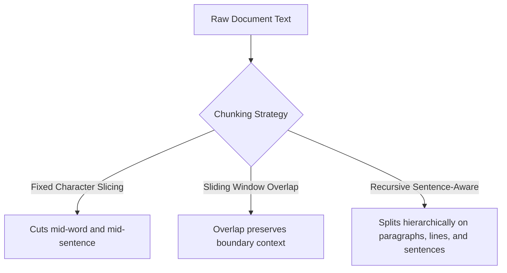
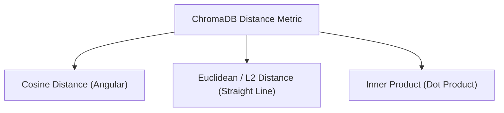

# Architecture & Technical Foundation

Technical reference detailing vector representations, tokenization mechanics, text chunking algorithms, distance metrics, and graph-based HNSW indexing.

## Tokenization and Embeddings

### Representation Analysis

| Attribute | Tokenization (Lexical) | Embedding (Semantic) |
| :--- | :--- | :--- |
| **Output Format** | Discrete Integers | Continuous Floating-Point Arrays |
| **Representation** | Vocabulary index lookup | High-dimensional spatial coordinates |
| **Example Output** | `"cat"` maps to integer ID `9243` | `"cat"` maps to continuous spatial vector |
| **Vector Arithmetic** | Not applicable | Valid semantic vector operations |
| **Reversibility** | Deterministic lookup | Lossy spatial projection |
| **System Role** | Text preprocessing | Spatial Indexing & Nearest Neighbor Search |

> Tokenization provides discrete integer identifiers for vocabulary mapping. Embeddings project those identifiers into a high-dimensional vector space where physical proximity corresponds to conceptual similarity.

## Text Chunking Strategies

Natural language flows continuously across documents, but embedding models operate on fixed token context windows. Chunking strategy directly impacts vector retrieval accuracy and recall.

### Strategy Comparison

1. **Sliding Window Overlap**: Content severed at the boundary of a chunk is preserved intact within the subsequent chunk.
2. **Recursive Splitting**: Hierarchically splits on natural text delimiters (paragraphs, newlines, sentence periods, and spaces) before applying character limits.

## Vector Distance Metrics

Vector databases calculate spatial proximity using mathematical distance metrics:

### Metric Characteristics

- **Cosine Distance**: Measures the directional angle between vectors, producing normalized similarity scores between 0.0 and 1.0.
- **Euclidean / L2 Distance**: Measures straight-line distance in vector space. Requires vector length normalization for consistent scoring.
- **Inner Product**: Measures spatial alignment and magnitude across vector dimensions.

> Computing `1 - distance` to calculate similarity is only valid when the collection is configured for Cosine Distance. For Euclidean or Inner Product spaces, other normalization rules apply.

## HNSW Graph Indexing Mechanics

To search vector collections efficiently without scanning every document linearly, ChromaDB constructs a Hierarchical Navigable Small World (HNSW) graph index.

### Graph Layer Traversal

- **Express Top Layers**: Sparse, long-range connections for fast spatial traversal across distant regions of the vector space.
- **Base Layer**: Dense local neighborhood connections containing all indexed vectors.
- **Search Efficiency**: Enables logarithmic search scalability as dataset sizes grow.
