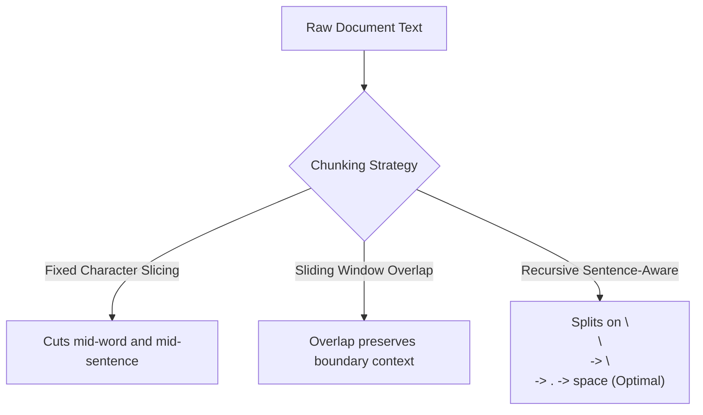
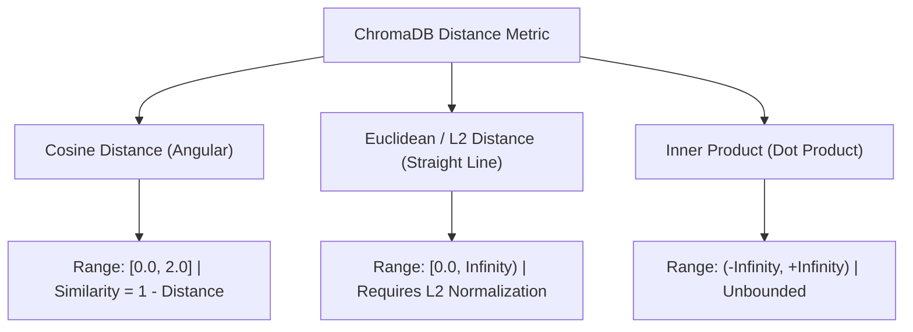

# Architecture & Technical Foundation

> **Abstract**: Technical reference detailing vector representations, tokenization mechanics, text chunking algorithms, distance metrics, and graph-based HNSW indexing.

---

## 1. Tokenization vs. Embeddings


### Representation Analysis

| Attribute | Tokenization (Lexical) | Embedding (Semantic) |
| :--- | :--- | :--- |
| **Output Format** | Discrete Integers (`int`) | Continuous Vectors (`float[]`) |
| **Representation** | Vocabulary index lookup | High-dimensional spatial coordinates |
| **Example Output** | `"cat"` $\rightarrow$ `9243` | `"cat"` $\rightarrow$ `[0.12, -0.45, 0.89, -0.11, ...]` |
| **Vector Arithmetic** | Invalid | Valid (`King - Man + Woman ≈ Queen`) |
| **Reversibility** | Deterministic (`9243` $\rightarrow$ `"cat"`) | Lossy / One-way projection |
| **System Role** | Tokenizer Preprocessing | Spatial Indexing & Nearest Neighbor Search |

> [!NOTE]
> Tokenization provides discrete integer identifiers for vocabulary mapping. Embeddings project those identifiers into a high-dimensional vector space where distance corresponds to semantic similarity.

---

## 2. Text Chunking Strategies

Natural language flows continuously across documents, but embedding models operate on fixed token context windows. Chunking strategy directly impacts vector retrieval recall.

```text
Full Text: "SLIIT reserves the right to decline or de-register students who have not completed fee payments."
            |----------------------------------------| (Chunk 0: Cuts off mid-phrase at 'decline or d')
                              |----------------------------------------| (Chunk 1: Intact 'decline or de-register')
```

### Strategy Comparison



1. **Sliding Window Overlap**: Content severed at the boundary of Chunk $N$ is preserved intact within Chunk $N+1$.
2. **Recursive Splitting**: Hierarchically splits on structural delimiters (`\n\n` $\rightarrow$ `\n` $\rightarrow$ `. ` $\rightarrow$ ` `) before falling back to character limits, preserving paragraphs and sentence structures.

---

## 3. Vector Distance Metrics

Vector databases calculate spatial proximity using mathematical distance metrics:



### Metric Formulations

- **Cosine Distance** (`"hnsw:space": "cosine"`):
  $$\text{Cosine Similarity} = \max\left(0, \min\left(1, 1 - \text{Cosine Distance}\right)\right)$$

- **Euclidean / L2 Distance** (`"hnsw:space": "l2"`):
  $$d = \sqrt{\sum_{i=1}^n (x_i - y_i)^2}$$

> [!WARNING]
> Computing `1 - distance` is only mathematically valid when the vector space is explicitly configured for Cosine Distance. For Euclidean or Inner Product spaces, `1 - distance` produces invalid or negative scores.

---

## 4. HNSW Indexing Mechanics

To search large vector collections without performing $O(N)$ brute-force comparisons, ChromaDB constructs a **Hierarchical Navigable Small World (HNSW)** graph index.

### Multi-Layer Graph Architecture

```text
Layer 2 (Express Layer):    [ Node A ] ──────────────────────────────────────────> [ Node Z ]
                                │                                                       │
                                ▼                                                       ▼
Layer 1 (Regional Layer):   [ Node A ] ──────────> [ Node K ] ──────────> [ Node P ] ───> [ Node Z ]
                                │                      │                      │          │
                                ▼                      ▼                      ▼          ▼
Layer 0 (Base Layer):       [Node A]--[Node B]--...--[Node K]--[Node L]--...--[Node P]--[Node Z]
```

1. **Top Layer**: Sparse long-distance links for rapid spatial traversal.
2. **Base Layer**: Dense local neighborhood links containing all indexed vectors.
3. **Query Latency**: Achieves $O(\log N)$ logarithmic search complexity.
