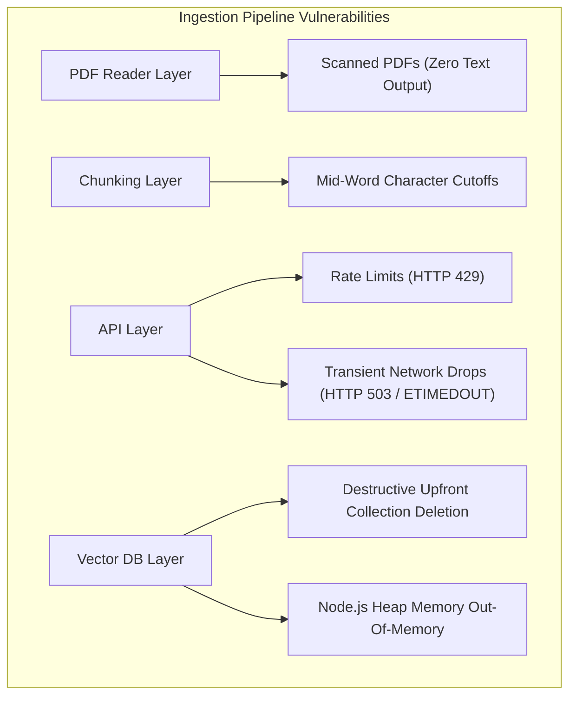

# Failure Mode Audit & System Hardening

Technical analysis of failure modes identified in naive vector search implementations and the production hardening patterns applied to resolve them.

## System Vulnerability Matrix



## Vulnerability Analysis & Hardening Implementation

### Vulnerability 1: Destructive Upfront Collection Deletion

- **Issue**: Executing `chroma.deleteCollection()` prior to ingestion starting. If vector generation fails mid-stream, existing indexed data is lost.
- **Hardening Strategy**: Non-destructive atomic upserts (`collection.upsert()`) namespaced by document identifier. Live data remains untouched until new ingestion completes cleanly.

```typescript
// Atomic Namespace & Upsert Pattern (ingest.ts)
const sanitizeId = path.basename(filePath).replace(/[^a-zA-Z0-9]/g, "_");
const ids = batchIndices.map((idx) => `${sanitizeId}_chunk_${idx}`);

await collection.upsert({ ids, embeddings: batchEmbeddings, metadatas, documents });
```

### Vulnerability 2: API Rate Limits and Transient Connection Failures

- **Issue**: Executing un-retried API calls inside a tight loop. Large documents trigger rate limits (`HTTP 429`) or transient timeouts (`HTTP 503 / ETIMEDOUT`).
- **Hardening Strategy**: Exponential backoff with randomized delay retries (1s, 2s, 4s, 8s plus random jitter).

```typescript
// Exponential Backoff Loop (ingest.ts / ask.ts)
if (attempt < maxRetries && isTransient) {
  const jitter = Math.random() * 250;
  const delay = baseDelay * Math.pow(2, attempt) + jitter;
  await new Promise((r) => setTimeout(r, delay));
}
```

### Vulnerability 3: Unbounded Memory Allocation (Heap Out Of Memory)

- **Issue**: Accumulating all vectors, metadata objects, and strings in memory arrays before database insertion.
- **Hardening Strategy**: Streaming batch flushes (`batchSize = 10`) to keep active memory bounded.


### Vulnerability 4: Character-Level Boundary Severing

- **Issue**: Naive character slicing truncates words and sentence structures at arbitrary boundaries.
- **Hardening Strategy**: Recursive sentence-aware chunking (`recursiveChunkText()`), splitting hierarchically on paragraphs, lines, periods, and spaces.

### Vulnerability 5: Irrelevant Search Noise (Off-Topic Queries)

- **Issue**: Vector databases return top matches regardless of spatial distance.
- **Hardening Strategy**: Relevance threshold filtering (`MIN_SIMILARITY_THRESHOLD = 0.35`). Queries returning similarity scores below the threshold are filtered out.

## System Comparison

| System Layer | Naive Implementation | Hardened Implementation | Impact |
| :--- | :--- | :--- | :--- |
| **API Layer** | Single call (crashes on 429) | Exponential Backoff with Jitter | Prevents rate-limit crashes |
| **Database Layer** | Destructive upfront wipe | Non-destructive Atomic Upserts | Zero risk of data loss |
| **Memory Management** | Full in-memory buffer | Streaming Batch Flushes | Keeps heap memory stable |
| **Text Processing** | Hard character slicing | Recursive Sentence-Aware Splitting | Preserves semantic context |
| **Search Guardrails** | Unfiltered Top K | Similarity Threshold Filter | Eliminates off-topic noise |
