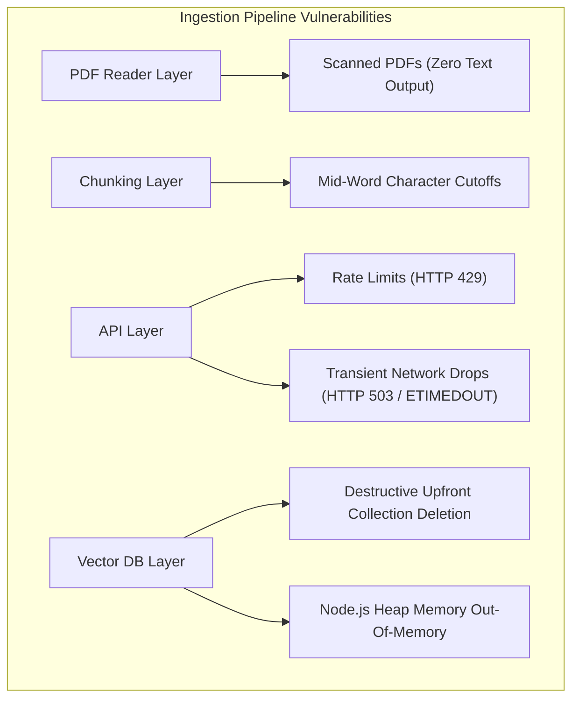
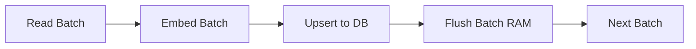

# Failure Mode Audit & System Hardening

> **Abstract**: Technical analysis of failure modes identified in naive vector search implementations and the production hardening patterns applied to resolve them.

---

## 1. System Vulnerability Matrix



---

## 2. Vulnerability Analysis & Hardening Implementation

### Vulnerability 1: Destructive Upfront Collection Deletion
- **Issue**: Executing `chroma.deleteCollection()` prior to ingestion starting. If vector generation fails mid-stream (e.g., at chunk 99/100 due to API error), existing indexed data is lost.
- **Hardening Strategy**: Non-destructive **Atomic Streaming Upserts** (`collection.upsert()`) namespaced by document ID. Live data remains untouched until new ingestion completes cleanly.

```typescript
// Atomic Namespace & Upsert Pattern (ingest.ts)
const sanitizeId = path.basename(filePath).replace(/[^a-zA-Z0-9]/g, "_");
const ids = batchIndices.map((idx) => `${sanitizeId}_chunk_${idx}`);

await collection.upsert({ ids, embeddings: batchEmbeddings, metadatas, documents });
```

---

### Vulnerability 2: API Rate Limits and Transient Connection Failures
- **Issue**: Executing un-retried API calls inside a tight loop. Large documents trigger rate limits (`HTTP 429`) or transient timeouts (`HTTP 503 / ETIMEDOUT`).
- **Hardening Strategy**: **Exponential Backoff with Randomized Delay Jitter** ($1\text{s}, 2\text{s}, 4\text{s}, 8\text{s} + \text{jitter}$).

```typescript
// Exponential Backoff Loop (ingest.ts / ask.ts)
if (attempt < maxRetries && isTransient) {
  const jitter = Math.random() * 250;
  const delay = baseDelay * Math.pow(2, attempt) + jitter;
  await new Promise((r) => setTimeout(r, delay));
}
```

---

### Vulnerability 3: Unbounded Memory Allocation (Heap OOM)
- **Issue**: Accumulating all vectors, metadata objects, and strings in memory arrays before database insertion.
- **Hardening Strategy**: **$O(1)$ Memory Streaming Batch Flushes** (`batchSize = 10`).



---

### Vulnerability 4: Character-Level Boundary Severing
- **Issue**: Naive character slicing (`slice(800)`) truncates words and sentence structures at arbitrary boundaries.
- **Hardening Strategy**: **Recursive Sentence-Aware Chunking** (`recursiveChunkText()`), splitting hierarchically on `\n\n` $\rightarrow$ `\n` $\rightarrow$ `. ` $\rightarrow$ ` `.

---

### Vulnerability 5: Irrelevant Search Noise (Off-Topic Queries)
- **Issue**: Vector databases return top $K$ results regardless of spatial distance.
- **Hardening Strategy**: **Relevance Guardrail Thresholding** (`MIN_SIMILARITY_THRESHOLD = 0.35`). Queries returning similarity scores below 0.35 are rejected.

---

## 3. System Comparison

| System Layer | Naive Implementation | Hardened Implementation | Impact |
| :--- | :--- | :--- | :--- |
| **API Layer** | Single call (crashes on 429) | Exponential Backoff + Jitter Retry | Elimination of rate-limit crashes |
| **Database Layer** | Destructive upfront wipe | Non-destructive Atomic Upserts | Zero risk of data loss |
| **Memory Management** | $O(N)$ RAM Array Allocation | $O(1)$ Streaming Batch Flushes | Elimination of heap OOM crashes |
| **Text Processing** | Character slicing | Recursive Sentence-Aware Splitting | Context preservation |
| **Search Guardrails** | Unfiltered Top K | Threshold Filter (`>= 0.35`) | Rejection of off-topic noise |
